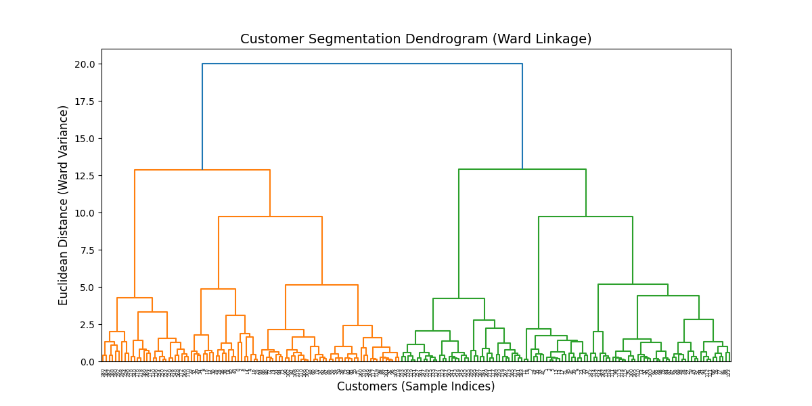
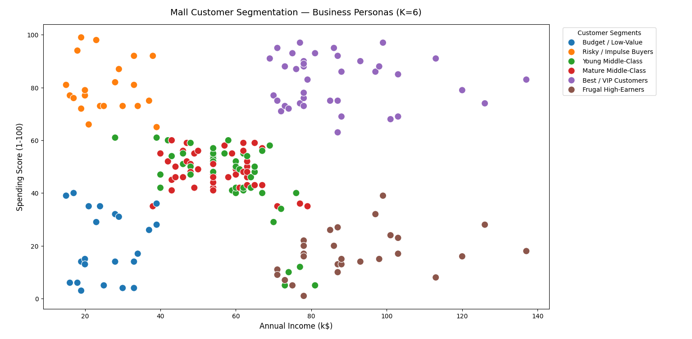

# 🛍️ Mall Customer Segmentation using Hierarchical Clustering

I built this end-to-end Data Science project to segment mall customers into actionable business personas using **Agglomerative Hierarchical Clustering**. 

Instead of guessing the number of clusters, I used a **Ward Linkage Dendrogram** combined with **Silhouette Score analysis** to mathematically determine the optimal cluster count ($K=6$).

## 🔍 Workflow & Methodology

1. **Data Hygiene & EDA:** Verified the dataset has 200 clean customer records with 0 missing values and 0 duplicate rows.
2. **Feature Selection:** Dropped `CustomerID` (arbitrary index) and kept `Gender` out of the spatial math to avoid artificial binary split boundaries.
3. **Feature Scaling:** Standardized features using `StandardScaler` ($\mu=0, \sigma=1$) so large income dollar values don't dominate Euclidean distance math over Age or Spending Score.
4. **Dendrogram Analysis:** Computed the Ward Linkage matrix to minimize within-cluster variance.
5. **Silhouette Score Validation:** Evaluated cluster counts from $K=2$ to $7$. $K=6$ achieved the highest Silhouette Score (**0.4201**).
6. **Persona Mapping:** Mapped cluster numbers to real-world marketing personas and exported the final enriched dataset to `segmented_customers.csv`.

## 📊 Identified Customer Personas ($K=6$)

| Cluster | Mean Age | Mean Income | Mean Spending | Persona Name | Recommended Business Strategy |
| :---: | :---: | :---: | :---: | :--- | :--- |
| **1** | 43.9 | $91.3k | 16.7 | **Frugal High-Earners** | Target with long-term investment, high-durability luxury product ads. |
| **2** | 44.3 | $25.8k | 20.3 | **Budget / Low-Value** | Focus on essential utility goods and clearance discount catalogs. |
| **3** | 56.4 | $55.3k | 48.4 | **Mature Middle-Class** | Family/home deals, traditional promotions, and seasonal holiday sales. |
| **4** | 32.7 | $86.5k | 82.1 | 💎 **Best / VIP Customers** | VIP loyalty club, personal shoppers, early access to new releases. |
| **5** | 24.8 | $25.6k | 80.2 | ⚡ **Risky / Impulse Buyers** | Social media trend ads, flash sales, Buy-Now-Pay-Later (BNPL) deals. |
| **6** | 27.4 | $57.5k | 45.8 | **Young Middle-Class** | Tech gadgets, modern fashion, and digital subscription deals. |

## 📈 Visual Results

### 1. Hierarchical Dendrogram (Ward Linkage)

### 2. Business Personas Scatter Plot

> 💡 **Spatial Insight:** Notice how Cluster 3 (Mature Middle-Class) and Cluster 6 (Young Middle-Class) overlap on the 2D Income vs. Spending plot. They are actually cleanly separated in 3D space along the **`Age`** axis ($56.4$ yrs vs $27.4$ yrs)!
